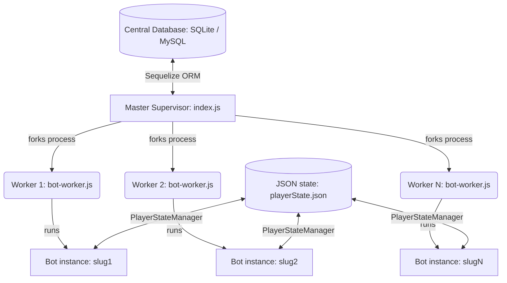

# 🤖 Multi-Bot Orchestrator & Music Engine (v16.0)

[](https://nodejs.org/)
[](https://discord.js.org/)
[](https://nodejs.org/api/child_process.html)
[](https://sequelize.org/)
[](./LICENSE)

A high-performance, enterprise-grade **Multi-Bot Orchestration Platform** and advanced music engine designed for Discord. Rather than running a single monolithic instance, this system acts as a **Master Supervisor** that dynamically spawns, manages, and lifecycle-monitors an unlimited number of isolated Discord music bot instances—each running inside its own sandboxed process.

---

## 📖 Table of Contents

* [System Architecture](#-system-architecture)
* [Core Features](#-core-features)
* [Tech Stack](#-tech-stack)
* [Prerequisites & OS Setup](#-prerequisites--os-setup)
* [Step-by-Step Installation](#-step-by-step-installation)
* [Environment Variables Configuration](#-environment-variables-configuration)
* [Interactive Management CLI](#%EF%B8%8F-interactive-management-cli)
* [Application Commands & Controls](#-application-commands--controls)
* [Directory & Project Structure](#-directory--project-structure)
* [Development & Technical Notes](#-development--technical-notes)
* [Mitigating YouTube Bot Detection](#-mitigating-youtube-bot-detection)
* [Contributing](#-contributing)
* [License](#-license)
* [Support & Community](#-support--community)

---

## 🏛️ System Architecture

Standard Discord bots struggle with scalability, single-threaded CPU bottlenecks, and global application crashes. The **Multi-Bot Orchestrator** resolves this by employing a master-worker process architecture:



* **Isolated Worker Pools:** The Master Supervisor (`index.js`) queries your database for all active bots and forks them into independent Node.js processes using `child_process.fork()`. If a single bot worker crashes, the parent orchestrator intercepts the exit event, spins up a replacement process in under 2 seconds, and leaves all other running bot instances entirely unaffected.
* **Database-Driven Orchestration:** All bot tokens, prefixes, branding settings, and channel restrictions are fetched dynamically. No token is hardcoded, and bots can be registered or updated on the fly.
* **Centralized State Persistence:** All bot workers record player statuses, active queues, volume preferences, and looping configurations via `PlayerStateManager` to a structured local JSON file. Workers resume playback in their respective channels automatically after supervisor restarts.

---

## ✨ Core Features

### 💾 Opus Audio Engine & Smart Local Caching
To completely eliminate audio stuttering and buffering latency, this system downloads track streams in raw/high-quality **Opus** format locally to an `audio_cache` directory prior to playback.
* **Zero-Lag Playback:** Streams directly from local disk storage.
* **Background Preloading:** Preloads the next queue track while the current one is active.
* **Smart Disk Management:** Automatically wipes cached audio files once playback is completed, unless preserved by active sessions in other guilds.

### 🔄 Resilient Voice Engine & Auto-Healing
Built on top of `@discordjs/voice` and `prism-media` with high-level stability overrides:
* **State Persistence:** Preserves voice status and channel positioning across restarts.
* **Auto-Reconnect:** Actively monitors connection health and automatically reconnects if network lag forces a disconnect.
* **Self-Healing Stream:** Gracefully skips corrupted audio chunks or retries stream generation before dropping playback.

### 🎲 Smart Autoplay Engine (Continuous Radio)
Keep the channels alive indefinitely with an advanced, genre-based autoplay algorithm:
* **20+ Selectable Genres:** Seamlessly switch between Pop, Rock, Hip-Hop, Anime, Lo-Fi, Synthwave, and more.
* **Content Filtering:** Automatically rejects podcasts, long streams, and tutorial videos by checking duration metrics and descriptive keywords.
* **Official Track Verification:** Prioritizes verified music videos, lyric releases, and high-retention tracks.

### 🌏 Hot-Loadable Global Localization
Features **21 fully customized language packs** stored in modular JSON templates:
* **Supported Languages:** Arabic (`ar`), Danish (`da`), German (`de`), English (`en`), Spanish (`es`), Finnish (`fi`), French (`fr`), Hindi (`hi`), Indonesian (`id`), Italian (`it`), Japanese (`ja`), Korean (`ko`), Dutch (`nl`), Norwegian (`no`), Polish (`pl`), Portuguese (`pt`), Russian (`ru`), Swedish (`sv`), Turkish (`tr`), Simplified Chinese (`zh_CN`), and Traditional Chinese (`zh_TW`).
* **Instant Configuration:** Dynamic server-specific translation switching without redeployments.

### 📜 Paginated Lyrics Manager
Integrates **Genius** and **LRCLIB** API engines to fetch synchronized track lyrics directly inside Discord. Features smooth embed pagination and multi-language/non-English query searching.

### ⌨️ Terminal Management CLI (`music-cli`)
Manage your bot infrastructure directly from your console:
* **Command Wizard:** Easily add new bot profiles, token references, and custom commands.
* **Channel Binding:** Restrict specific bots to designated channel arrays globally or locally.
* **Status Controls:** Toggle, list, modify, or delete bot accounts instantly.

---

## 🛠️ Tech Stack

* **Runtime:** Node.js (>= v18.0.0)
* **API Wrapper:** Discord.js v14.18.0 (utilizing GatewayIntents for Guilds, VoiceStates, and Message Content)
* **Voice Engine:** `@discordjs/voice` & `@discordjs/opus` for Opus transcoding and audio processing
* **Stream Transcoding:** `prism-media` & `ffmpeg-static` for high-performance audio conversion
* **Extraction Engine:** `youtube-dl-exec` (`yt-dlp` wrapper) & `ytdl-core`
* **API Clients:** `axios` & `node-fetch` for scraper logic, `spotify-web-api-node` for Spotify metadata retrieval, and `genius-lyrics` for lyrics lookup
* **Database & ORM:** `sequelize` ORM supporting SQLite (default local development) and MySQL (production deployment)
* **CLI Engine:** `inquirer` & `chalk` for rich shell UI interactions

---

## 🐧 Prerequisites & OS Setup

Before installing the orchestrator, ensure your host system has the necessary dependencies:

### Ubuntu / Debian / CentOS
```bash
# 1. Update package managers
sudo apt-get update && sudo apt-get upgrade -y

# 2. Install FFmpeg, Python3, and core utilities
sudo apt-get install -y ffmpeg python3 curl build-essential

# 3. Setup Node.js v18+ LTS
curl -fsSL https://deb.nodesource.com/setup_18.x | sudo -E bash -
sudo apt-get install -y nodejs
```

### Windows
1. **Node.js:** Download and run the v18+ installer from the official [Node.js Portal](https://nodejs.org/).
2. **FFmpeg:** Download Windows binaries from [ffmpeg.org](https://ffmpeg.org/), extract the files, and append the `bin/` directory path to your **System Environment Variables (PATH)**.
3. **yt-dlp:** Download `yt-dlp.exe` and place it inside your System PATH.

---

## 🚀 Step-by-Step Installation

Follow these steps to deploy your orchestrator and establish your multi-bot instances:

### 1. Clone & Install Core Dependencies
Clone the repository to your host server and run npm installations:
```bash
# Navigate to the workspace
cd MusicBot

# Install npm dependencies
npm install
```

### 2. Configure Your Environment File
Duplicate the template configuration and modify environment values:
```bash
# Copy env template
cp .env.example .env
```
Open `.env` in your editor and configure the parameters (refer to the [Environment Variables](#-environment-variables-configuration) section).

### 3. Run Database Migrations
The orchestrator relies on relational database migrations to create schemas for bots, restricted channels, playlists, and items. Initialize the default SQLite / MySQL schemas using the Sequelize CLI:
```bash
npx sequelize-cli db:migrate
```

### 4. Register Bots in the CLI
Spawning bots requires database entries. Start the CLI wizard:
```bash
node music-cli/index.js
```
* Select **`➕ Add new bot`**
* Enter the Bot's Name, its unique Slug identifier (e.g., `music-1`), and the **`.env` key name** where its Discord Token is located (e.g. `BOT_TOKEN_1`).
* Set its custom prefix (e.g., `-` or `!`).
* (Optional) Select **`➕ Add channels to bot`** to restrict its active listening to dedicated Discord text channels.

### 5. Launch the Orchestrator
Start the Master Supervisor process to spawn the registered bots:
```bash
# Start via npm script
npm start

# Or launch index.js directly
node index.js
```
The console will display real-time logs as each worker process is initialized and logged into Discord.

---

## ⚙️ Environment Variables Configuration

The following table breaks down all environment settings supported by the system in `.env`:

| Variable | Required | Default | Description |
| :--- | :---: | :---: | :--- |
| **`DISCORD_TOKEN`** | Yes (Default Bot) | - | The primary fallback bot token. Used by default scripts. |
| **`CLIENT_ID`** | Yes (Default Bot) | - | The application Client ID of your main bot (used for oauth invites). |
| **`GUILD_ID`** | No | `null` | Target server ID (Guild) for registering commands immediately (testing only). |
| **`DB_HOST`** | No | `localhost` | Relational database hostname (for MySQL dialect configurations). |
| **`DB_USER`** | No | `root` | Relational database username. |
| **`DB_PASS`** | No | - | Relational database password. |
| **`DB_NAME`** | No | `discord_music` | Relational database schema name. |
| **`EMBED_COLOR`** | No | `#FF6B6B` | Hex color code applied to bot embeds. |
| **`STATUS`** | No | `🎵 MusicMaker...` | Default custom listening presence. |
| **`SUPPORT_SERVER`** | No | - | Support Discord invite link embedded inside the help command. |
| **`WEBSITE`** | No | - | External website link displayed in user interfaces. |
| **`SPOTIFY_CLIENT_ID`** | No | - | Spotify Developer Client ID (enables Spotify URL lookups). |
| **`SPOTIFY_CLIENT_SECRET`** | No | - | Spotify Developer Secret key. |
| **`GENIUS_CLIENT_ID`** | No | - | Genius API ID to speed up lyrics fetching. |
| **`GENIUS_CLIENT_SECRET`**| No | - | Genius API Secret. |
| **`TOTAL_SHARDS`** | No | `auto` | Shard count for the bot (for 1000+ servers). |
| **`SHARD_LIST`** | No | `auto` | Specific shard IDs this node should spawn. |
| **`SHARD_MODE`** | No | `process` | Large-scale sharding mode: `process` (isolated workers) or `worker` (threads). |
| **`SHARD_RESPAWN`** | No | `true` | Auto-reboot crashed shards immediately. |
| **`SHARD_SPAWN_DELAY`** | No | `5500` | Microseconds to pause between shard spawns to avoid Discord rate limits. |
| **`COOKIES_FROM_BROWSER`**| No | - | Extracts authentication from local browser: `chrome`, `firefox`, `edge`, `safari`. |
| **`COOKIES_FILE`** | No | - | Path to a Netscape formatted `cookies.txt` (strongly recommended on servers). |

---

## ⌨️ Interactive Management CLI

The built-in CLI (`music-cli/index.js`) is an interactive administration wizard that gives you total control over the environment database.

```
🔧 Multi-Bot Manager CLI

Choose an action:
  ➕ Add new bot
  📜 List all bots
  ➕ Add channels to bot
  🗑️ Delete bot
  ⚙️ Update bot settings
  ❌ Exit
```

* **Bot Settings Options:** Modify general properties or configure automated behavior (e.g. `auto_join_guild` and `auto_join_channel`).
* **Channel Filtering:** By default, if no allowed channels are bound to a bot in the CLI, it listens to all text channels. Adding specific channel IDs binds the bot to only react to commands executed in those zones.

---

## 🎮 Application Commands & Controls

The orchestrator registers modern slash commands and handles prefix/alias commands via a robust message handler.

### Text & Slash Commands

| Command | Shorthands | Description |
| :--- | :--- | :--- |
| **`/play [query]`** | `p` | Streams music from YouTube, Spotify, SoundCloud, or direct URLs. |
| **`/search [query]`** | - | Searches YouTube and presents the top 5 results for interactive selection. |
| **`/nowplaying`** | `np` | Opens the graphical music panel with live stream progression and buttons. |
| **`/volume [0-100]`**| `v` | Sets the playback decibel level. (e.g. `-v10`, `-v+10` increase/decrease). |
| **`/language [code]`**| `lang` | Changes the localized response language of the server. |
| **`/playlist`** | `pl` | Interactive controls to manage custom SQLite-saved user playlists. |
| **`/skip`** | `s` | Moves forward to the next queued track. |
| **`/stop`** | - | Clears the current tracklist, stops playback, and leaves the channel. |
| **`/help`** | `h` | Lists active commands, system configurations, and bot runtime metrics. |

### 🎛️ Interactive Controls Embed
When `/nowplaying` is triggered, the bot generates a dynamic user interface with interactive buttons. Users with permission can toggle playback options instantly:

* **▶️ / ⏸️ Play/Pause:** Toggles the voice stream paused state.
* **⏭️ Skip:** Skips the current song.
* **⏹️ Stop:** Halts playback and disconnects the bot.
* **🔁 Loop:** Toggles through Loop Modes (Track Loop, Queue Loop, Loop Off).
* **📻 Autoplay:** Activates the intelligent autoplay algorithm.
* **📜 Queue:** Prints the list of upcoming tracks.

---

## 📂 Directory & Project Structure

The project structure is modularized, isolating data models, background runners, command actions, and platform engines:

```
MusicBot/
├── audio_cache/            # Isolated directory storing temporary Opus chunks
├── bots/                   # Orchestrator child processes
│   └── bot-worker.js       # Target script spawned for each bot process
├── commands/               # Command-handling directories
│   └── custom/             # Core slash/prefix command files (play, volume, etc.)
├── config/                 # Relational database config (MySQL/SQLite settings)
│   ├── config.js           # Dynamic database router pointing to SQLite
│   └── config.json         # MySQL development / production schemas
├── database/               # Local data file storage (SQLite DB, cached states)
├── events/                 # Discord.js Event listener files (ClientReady, messageCreate)
├── languages/              # 21 JSON localization translation templates
├── migrations/             # Sequelize database schema migrations (Bots, Channels, Playlists)
├── models/                 # Sequelize relational database models (Bot, BotChannel, Playlist)
├── music-cli/              # Inquirer-based terminal wizard files
├── src/                    # Bot Core Systems & Scraper Engines
│   ├── DirectLink.js       # Playback processor for raw HTTP/S media links
│   ├── LanguageManager.js  # Server localization controller
│   ├── LyricsManager.js    # Genius & LRCLIB paginated client
│   ├── MusicEmbedManager.js# Graphical interface / embed renderer
│   ├── MusicPlayer.js      # Main Audio Player controller (Voice state, streams)
│   ├── PlayerStateManager.js# JSON-based session recovery tracker
│   ├── SoundCloud.js       # SoundCloud parser
│   ├── Spotify.js          # Spotify API track/playlist retriever
│   └── YouTube.js          # Advanced scrape-first YouTube engine
├── index.js                # Core Multi-Bot Orchestrator / Process Supervisor
├── single-bot-runner.js    # Individual client bootstrapper and command router
├── multi-bot-loader.js     # Single-process loader (combines bots into one thread)
└── package.json            # Node.js project manifest & scripts
```

---

## 💻 Development & Technical Notes

If you plan to modify the codebase or contribute features, keep these structural mechanics in mind:

### Global Error Interceptors
Voice bots are prone to abrupt API exceptions. The bootstrapper (`single-bot-runner.js`) implements custom uncaught exception filters to intercept common Discord API errors:
* **Code `10062` (Unknown Interaction):** Intercepted and logged quietly. Prevents processes from crashing due to expired Discord gateway handshakes.
* **Code `40060` (Interaction Already Acknowledged):** Safely caught and dismissed.

### Cache Protection Logic
Because cached files are deleted after playback, the automated cache cleaner (`PlayerStateManager.js`) fetches active streams from the JSON database across **all** running worker processes. This prevents one bot instance from cleaning up an audio file that another bot is currently streaming.

### Local Seek Optimization
Inside `src/YouTube.js`, the playback engine evaluates if a target URL originates from Google Video servers:
```javascript
const canSeek = /googlevideo\.com/i.test(baseUrl);
if (seekSeconds > 0 && canSeek) {
    const startMs = Math.floor(seekSeconds * 1000);
    const separator = baseUrl.includes('?') ? '&' : '?';
    finalUrl = `${baseUrl}${separator}begin=${startMs}`;
}
```
If true, it appends a query parameter `begin` to perform fast, server-side seek actions rather than forcing local FFmpeg processing.

---

## 🍪 Mitigating YouTube Bot Detection

YouTube actively flags connections originating from VPS subnets and cloud providers. If your bot outputs:
`ERROR: [youtube] Sign in to confirm you're not a bot.`

Refer to our complete setup guide: **[YOUTUBE_FIX.md](file:///home/core/bots/MusicBot/YOUTUBE_FIX.md)**.

### Quick Fix Guide
1. **Method 1 (Browser Authentication):** In your `.env` set `COOKIES_FROM_BROWSER=chrome` (or `firefox`, `edge`, `safari`). This extracts local browser session cookies automatically. Only works if running on a personal computer where the browser is active.
2. **Method 2 (Netscape Export):** Install a cookie export extension in your browser, log in to YouTube, click export to generate `cookies.txt`, copy the file directly to your bot's root folder, and set `COOKIES_FILE=./cookies.txt` in `.env`. **(Highly recommended for VPS/dedicated servers)**.

---

## 🤝 Contributing

Contributions are welcome! Please follow these standards:
1. **Linting & Styling:** Maintain clean JavaScript formatting.
2. **Database Integrity:** If you modify bot variables, generate a Sequelize migration (`npx sequelize-cli migration:generate`).
3. **Localization:** Add new terms to **all** JSON dictionaries inside `/languages` using English as a baseline.

---

## 📜 License

This project is open-source software licensed under the **[MIT License](./LICENSE)**.

---

## 💬 Support & Community

* **Report Issues:** Open a bug report or feature request on our [GitHub Issues Page](https://github.com/umutxyp/musicbot/issues).
* **Join the Server:** Get real-time help and chat with other maintainers on our [Discord Support Server](https://discord.gg/tEHJZReZrs).

<div align="center">
    Built with ❤️ for the Discord community.
    <br>
    <b>Enjoying the bot? Give this repository a ⭐!</b>
</div>
